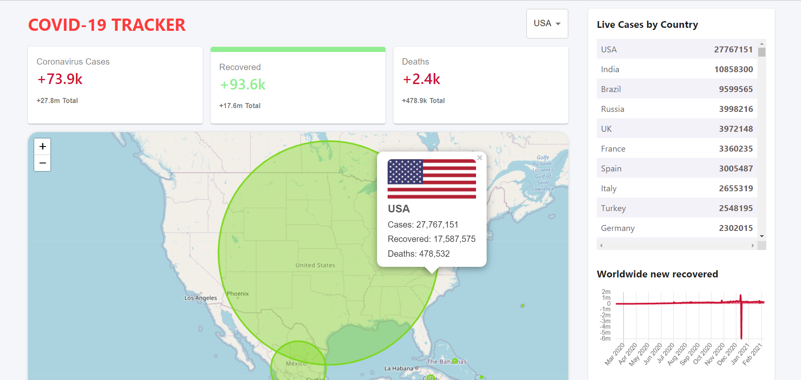

## Table of Contents

* [Description](#description)
* [Links](#links)
* [Screenshots](#screenshots)
* [Installation](#installation)
* [Usage](#usage)
* [Technologies Used](#technologies)
* [Contributing](#contributing)
* [Questions](#questions)

## Description

This is a global Covid-19 tracker that pulls information from desiease.sh open source API. See covid Stats as they are updated to show every day new cases, amount recovered and the deaths per country. Great Visuals with a Map Table and Graph to represent the information. 

## Links

[See the Covid-19 Tracker on Heroku](https://covid-tracker123212.herokuapp.com/)

## Screenshots

Landing page:

## Installation Instructions

run "npm i" in the root file of the application. 
run "npm start" to start development server on your localhost

## Usage

This application is to be used to track the stats of Covid-19. You can use the drop down at the top of the page to select the country you would like to see the data for. You can toggle between "new Cases" "recovered" or "deaths" stats by clicking to its respective info box. this will update the information on the LineGraph with the respective information. The size of the Circles represent the number of cases of that type in the country. The table on the right is sorted by most cases by country. App is mobile responsive and friendly on most devices. 

## Technologies Used

React, npm, chart.js/react-chartjs-2, numeral.js, leaflet.js/react-leaflet, MATERIAL-UI

## Contributing

Thank your to Clever Programmers for providing the resources to implement this build. 

I believe code is never finished, welcome your contributions to enhance the applications functionality. Please adhere to the Code of Conduct for the Contributer Covenant, version 2.0, at https://www.contributor-covenant.org/version/2/0/code_of_conduct.html.

## Questions
If you have further projects and questions, you can find me on Github: [GITHUB](https://github.com/benimahat1291). 
please visit my portfolio to find contact information: [BENI MAHAT](https://benimahat1291.github.io/Portfolio_v2/#/). 
